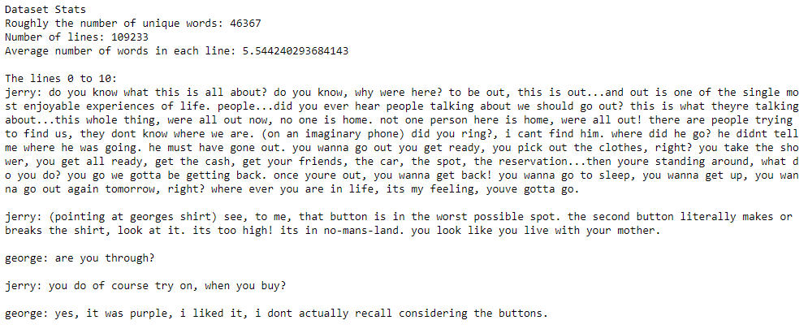

# TV Script Generator
This folder contains my solution to the _"TV Script Generation"_ problem presented as the third project in the Deep Learning Nano Degree by Udacity.

### Overview
For this project I was given a 3.41 MB file of Scripts taken from the Seinfeld sitcom.

### Purpose and Results
Before training the model, the dataset must be prepared by removing tokens and identifying unique words. With batches and sequence lengths specified, dataloaders can be created.

