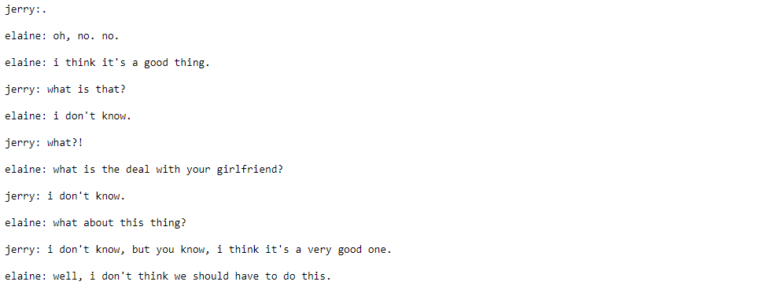

# TV Script Generator
This folder contains my solution to the _"TV Script Generation"_ problem presented as the third project in the Deep Learning Nano Degree by Udacity.

### Overview
For this project I was given a 3.41 MB file of Scripts taken from the Seinfeld sitcom.

### Purpose and Results
Before training the model, the dataset must be prepared by removing tokens and identifying unique words. With batches and sequence lengths specified, dataloaders can be created.


The Goal of the project is to train a Recurrent Neural Network on the scripts and use the trained model to generate new scripts.



This Model achieved a training loss of 3.43, with the following hyperparameters:
* <b>sequence_length</b>: This value was tested at 200, then 100, then 50, then 25, then 10. 
* <b>batch_size</b>: this value was set to 50, then 100 then 200. 
* <b>num_epochs</b>: this value was statically set to 20. 
* <b>learning_rate</b>: this value was tested at 0.01, then 0.001. 
* <b>embedding_dim</b>: This value was tested at 300, then 400 and 200. 
* <b>hidden_dim</b>: This value was tested at 256, then 512 and 128. 
* <b>n_layers</b>: this value was statically set to 2. 

### Conclusion
This project introduced me to many aspects of Recurrent Neural Networks. By covering the foundations of recurrent, LSTM and GRU layers, a firm understanding of the architecture was gained. Furthing this, the project touched on word embedding layers and their usefulness was soon realised.
<br><br>
To view the full project [click here](https://github.com/zainmujahid/Udacity---Deep-Learning-NanoDegree/blob/master/03%20-%20TV%20Script%20Generation/dlnd_tv_script_generation.ipynb)

# Requirements
Jupyter notebook must be installed.
Python must be installed. The following python modules must be installed.
```
opencv-python
jupyter
matplotlib
pandas
numpy
pillow
scipy
tqdm
scikit-learn
scikit-image
seaborn
h5py
ipykernel
bokeh
pickleshare
```