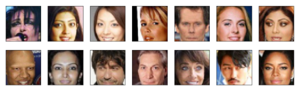
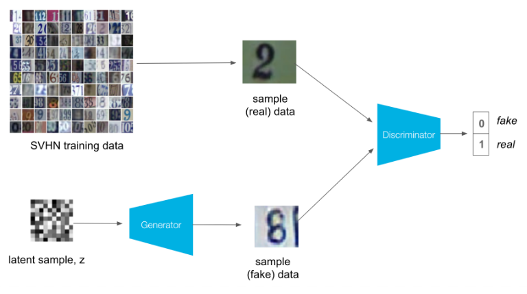

# Face Generation

## Overview 
For this project I was given a preprocessed dataset of celebrities faces, which can be downloaded [here]("https://s3.amazonaws.com/video.udacity-data.com/topher/2018/November/5be7eb6f_processed-celeba-small/processed-celeba-small.zip").

# Purpose
The Goal of this project was to create a general adverserial Neural Network (GAN) to generate new "fake" celebrity faces.

# Methadology
To train the image generator, a descriminator is needed that could decipher whether an image is real or fake. This descriminator is trained with alternating real and "fake" generated images. The descriminator is trained with the generator, leading to improvement in both models over time. As a result of this process, we create a generator that generates "fake" images which the decriminator cannot detect and these images can visually look quite real.

The Below process depicts the GAN training process of on the SVHN dataset.

